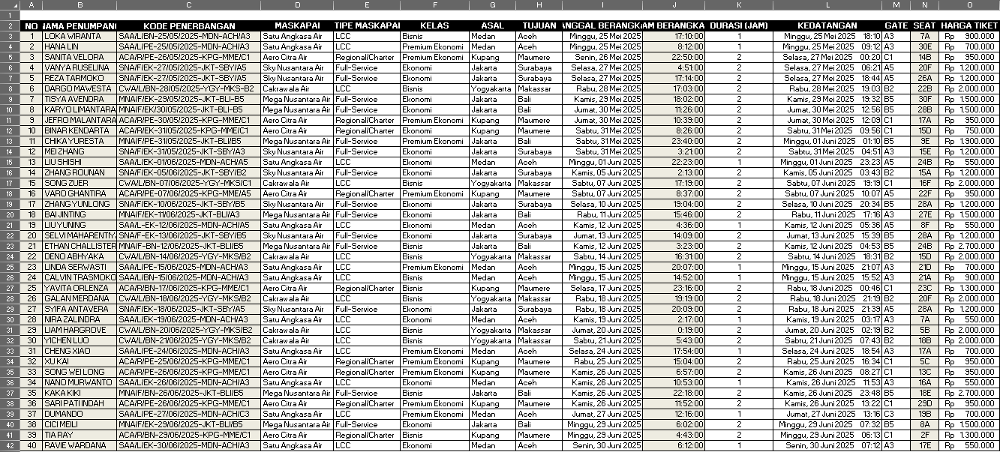
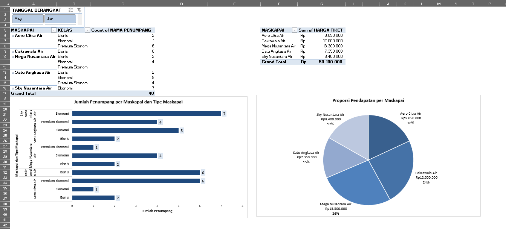

# Airport Ticket Pricing & Data Management System (Excel Portfolio)

## 📌 Project Overview
This repository contains an advanced Excel project designed to automate data retrieval, date calculations, and reporting for a mock airport prefecture flight database (**"Bandara Prefektur Ka-Yu"**). The project demonstrates proficiency in data cleansing, dynamic lookups, and business intelligence reporting.

## 🛠️ Excel Formulas & Techniques Demonstrated
This project showcases advanced Excel capabilities by utilizing complex nested formulas to extract, transform, and analyze airline data:

*   **Advanced Lookup (`VLOOKUP`, `VLOOKUP` + `MID`, `VLOOKUP` + `IF`):** Employed to dynamically fetch airline details, routes, and ticket pricing based on specific flight codes from separate reference tables.
*   **Text Manipulation (`IF` + `MID`, `RIGHT`):** Used to isolate specific text characters within custom flight codes to determine service classes (Economy, Business, Premium) and gate numbers.
*   **Date & Time Logic (`DATEVALUE` + `MID`):** Applied to convert raw text attributes into standard date formats to accurately calculate flight durations and departure schedules.

## 📋 Airline Booking Log Preview
*Below is a visual preview of the automated data sheet containing the processed flight logs:*

## 📊 Business Intelligence Dashboard (Pivot Tables & Charts)
An interactive analytics dashboard was constructed using **Pivot Tables**, **Pivot Charts**, and **Slicers** to extract actionable business insights from the flight logs:

*   **Passenger Distribution Analysis:** A comprehensive multi-level Pivot Table and horizontal bar chart breakdown showing the total number of passengers categorized by *Airline* and *Flight Class*.
*   **Revenue Share Breakdown:** A detailed financial summary utilizing a **Pie Chart** to illustrate the market share and total revenue generation per airline.
*   **Dynamic Data Filtering (Interactive Slicer):** Implemented an interactive monthly **Slicer (May / Jun)** allowing users to filter the entire dashboard instantly.

## 📁 Repository Structure
*   `Airline Booking Management System.xlsx` - The core Excel workbook containing the clean datasets, formulas, and Pivot Tables.
*   `README.md` - Documentation of the project.

## 🚀 How to Use This Project
1. Clone or download this repository.
2. Open `Airline Booking Management System.xlsx` using Microsoft Excel (2019 or newer recommended).
3. Interact with the **Pivot Tables** and check the formulas applied in the `Master_Data` and `Airline_Booking` tabs.

## 💬 Let's Connect! 
I am actively seeking Data Analyst opportunities where I can bridge the gap between complex data pipelines and corporate strategy.

LinkedIn: https://linkedin.com/in/aulia-khairunnisa
Email: aulkhairn@gmail.com
